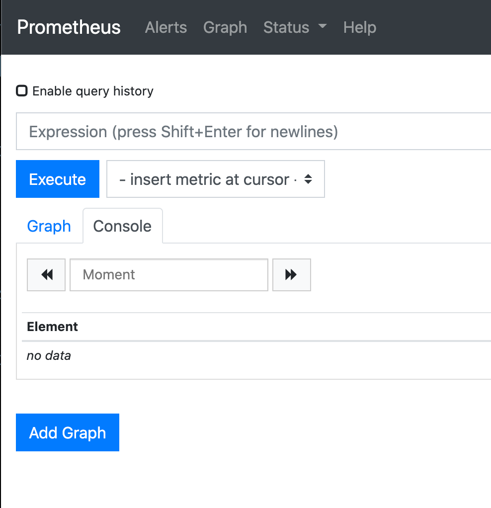

# kubernetes - prometheus & grafana

kubernetes 모니터링을 해보자.

참고 : <https://github.com/coreos/kube-prometheus#quickstart>

## install

```bash
cd ~/Desktop
git clone https://github.com/coreos/kube-prometheus.git
cd ~/Desktop/kube-prometheus

# Create the namespace and CRDs, and then wait for them to be availble before creating the remaining resources
kubectl create -f manifests/setup
kubectl create -f manifests/

# 확인
until kubectl get servicemonitors --all-namespaces ; do date; sleep 1; echo ""; done

## 삭제
kubectl delete --ignore-not-found=true -f manifests/ -f manifests/setup
kubectl delete --ignore-not-found=true -f manifests/ -f manifests
```

monitoring namespace에 설치가 다 되었다.

## prometheus dashboard 확인

포트 포워딩을 한다.

```bash
kubectl --namespace monitoring port-forward svc/prometheus-k8s 9090
```

웹사이트로 확인한다.

<http://localhost:9090>



## grafana 대시보드

포트 포워딩을 한다.

```bash
kubectl --namespace monitoring port-forward svc/grafana 3000
```

웹사이트로 확인한다.

<http://localhost:3000>

## 서비스를 만들어서 외부에 오픈하자.

### prometheus

```bash
vi ~/Desktop/kube-prometheus/manifests/prometheus-service.yaml
```

```yml
apiVersion: v1
kind: Service
metadata:
  labels:
    prometheus: k8s
  name: prometheus-k8s
  namespace: monitoring
spec:
  type: LoadBalancer # 여기 추가
  loadBalancerIP: 192.168.2.98 # 여기 추가
  ports:
    - name: web
      port: 80
      targetPort: web
  selector:
    app: prometheus
    prometheus: k8s
  sessionAffinity: ClientIP
```

k apply -f ~/Desktop/kube-prometheus/manifests/prometheus-service.yaml

### grafana

vi ~/Desktop/kube-prometheus/manifests/grafana-service.yaml

```yml
apiVersion: v1
kind: Service
metadata:
  labels:
    app: grafana
  name: grafana
  namespace: monitoring
spec:
  type: LoadBalancer # 여기 추가
  loadBalancerIP: 192.168.2.97 # 여기 추가
  ports:
    - name: grafana-http # 여기 수정
      port: 80 # 여기 수정
      targetPort: grafana-http # 여기 수정
  selector:
    app: grafana
```

```bash
k delete svc grafana
k apply -f ~/Desktop/kube-prometheus/manifests/grafana-service.yaml
```

<http://192.168.2.97/login> 확인 성공

일단 admin/admin으로 로그인을 하면 비번을 변경하라고한다. 원하는 비번으로 변경한다.

설치는 완료됬고 데이터소스를 붙여서 사용하면된다.
