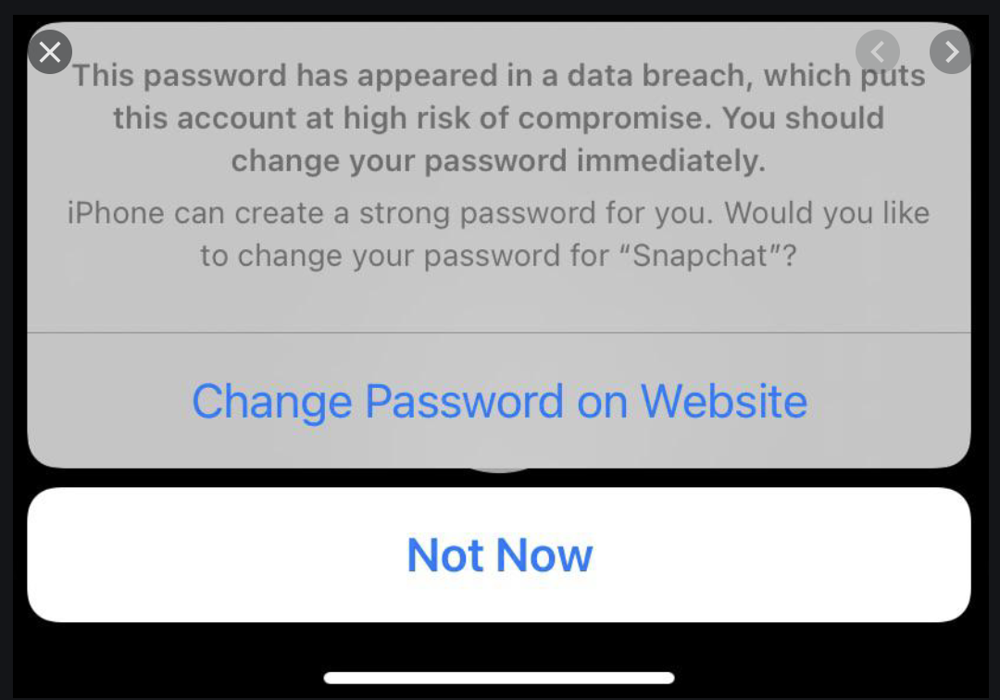
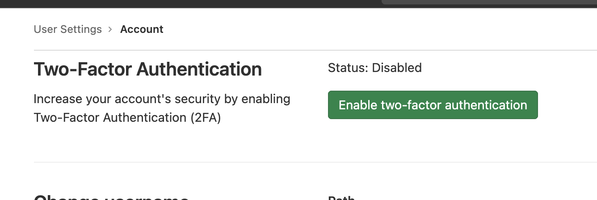
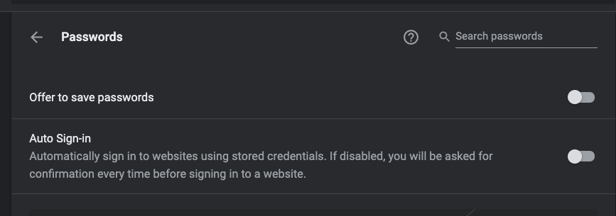

# 패스워드 보안관련

아침에 아이패드 사파리에서 로그인을 하는데 다음화면처럼 떴다.

음 뭐지 하면서 하나씩 정리해보기로 햇다.

## apple

ios에서 비밀번호 leaking이 된걸 확인해서 알람으로 보여준다. 관련기능은 세팅에서 끌수 있다.

동작방식은 어디엔가(정확히는 못찾앗음) 디비가 있고 그걸 로그인시 비교해서 잇으면 알려준다고함.

같은 디비를 쓰는거같은데 다음 사이트가 있어서 거기에서 leaking을 확인할수 있다.

<https://haveibeenpwned.com>

여기서 확인하면 리킹이 있어는지 확인이 된다.

같은 기능이 크롬에도 있고 여러군데 있다.

웹만 사용한다면 크롬도 괞찮은 솔류션인듯 보인다. 그런데 앱등을 같이 사용하고싶다.

## 해결 방법

일단 해결방법을 고민해봣다 모든 사이트의 비번을 하나로 사용하다가. 지금은 패턴을 조금씩 바꿔서 하면서 구글 스프레드시트에 적어두는 방식으로 사용햇다.

비밀번호 매니저를 사용해봐야겟다.

1.

2 Factor 인증

ms authentication / Google Authenticator

cloudflare : 2factor 처리

gitlab 2factor

user preferences >> account >> enable

## 크롬 비번 저장기능을 끄기 

e
