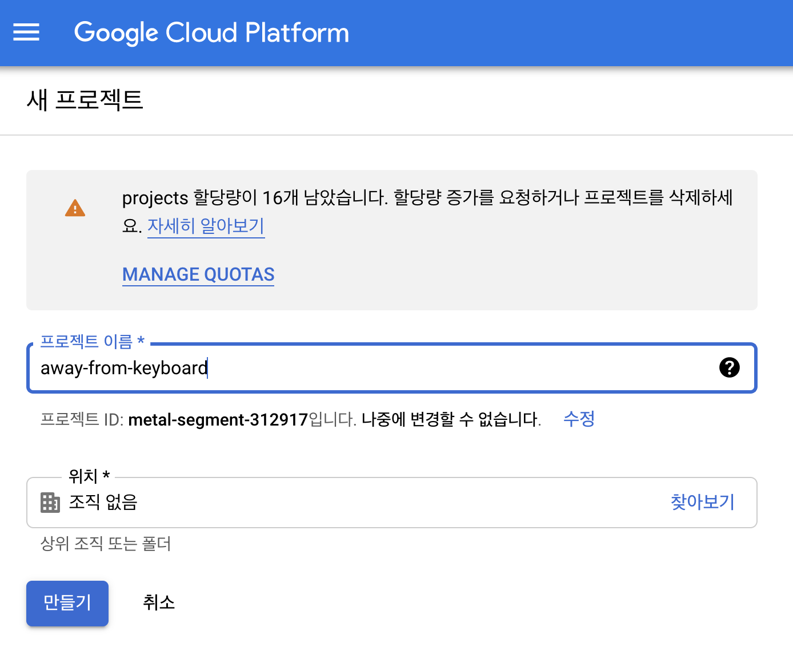

# chrome extension deploy - 02

깃액션을 통해서 앱을 자동으로 올려보자.

## google developer에 등록

본인 이메일로 등록한다.

<https://developers.google.com/>

## google cloud developer에서 프로젝트를 생성

구글 디벨로퍼 사이트에서 구글 클라우드를 클릭하고 console 을 찾아서 들어간다.

<https://console.cloud.google.com/> 여기에 직접 들어가도 된다.

이제 프로젝트를 하나 만든다.

새 프로젝트 클릭

away-from-keyboard 으로 하나 만들자.

## Create OAuth Credentials 

